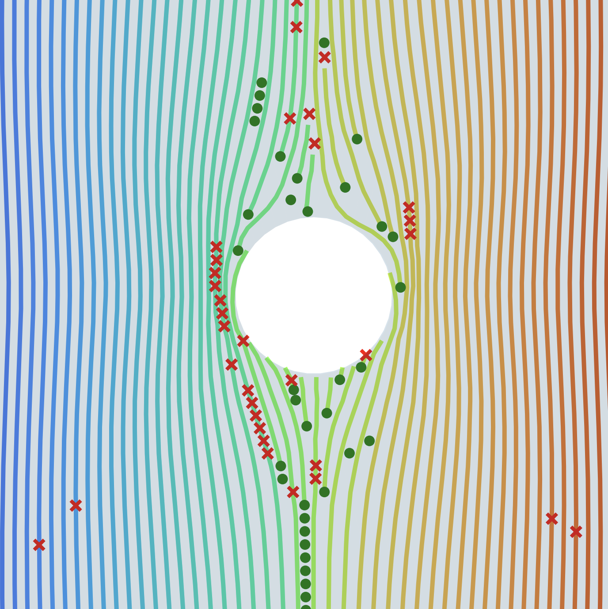
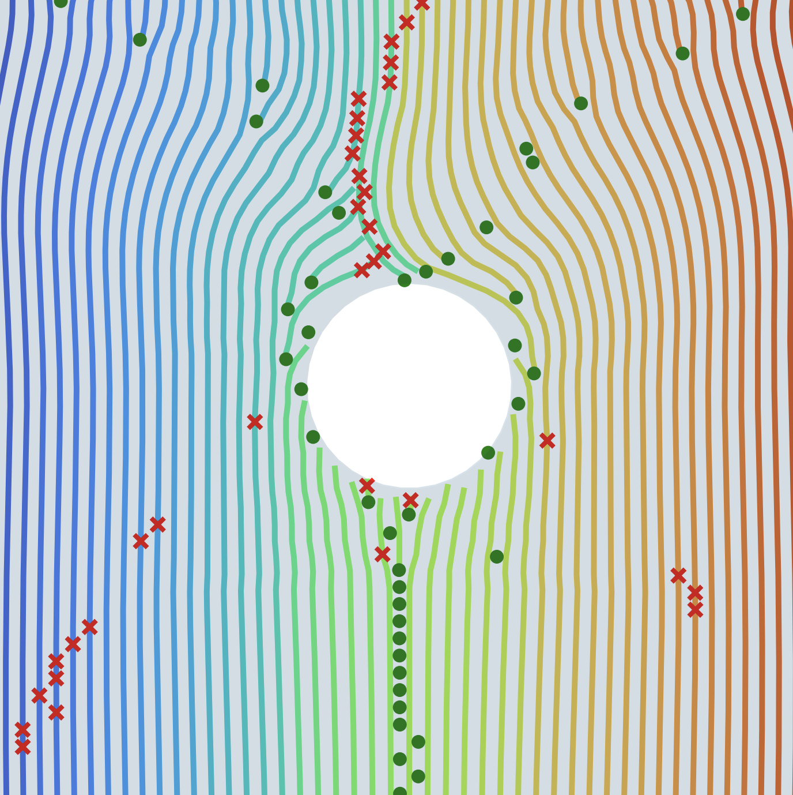
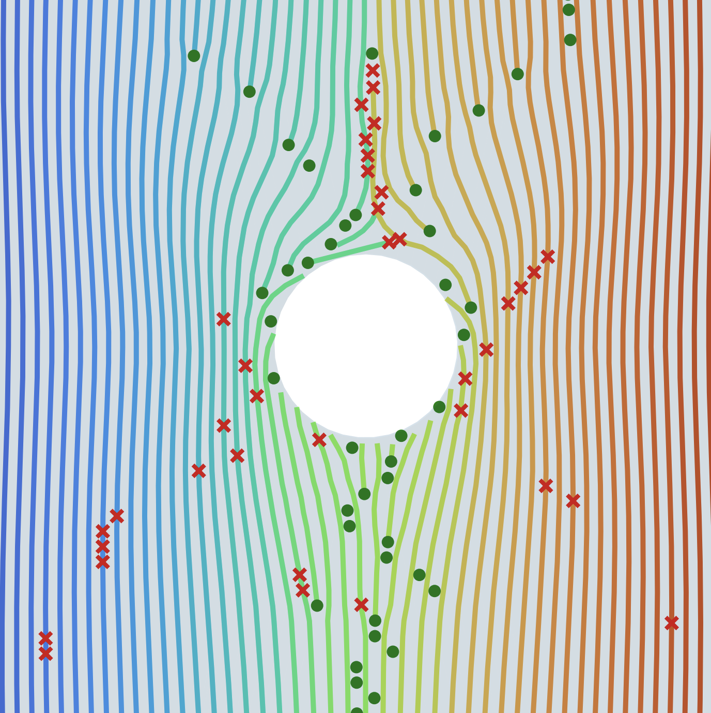

# Swarm-Based Trajectory Optimization for Stress-Aligned 3D Printing

[](https://arxiv.org/pdf/2404.10686)
[![CC BY-NC-SA 4.0][cc-by-nc-sa-shield]][cc-by-nc-sa]
[](https://www.python.org/)

A novel swarm-based approach for generating optimized stress-aligned trajectories for 3D printing applications, achieving **115× faster computation** than existing methods while improving mechanical properties by **~10%**.

  

## 🚀 Key Features

- **Ultra-Fast Computation**: 115× faster than state-of-the-art methods (198ms vs 22.7s)
- **Improved Mechanical Properties**: ~10% improvement in specific modulus
- **Flexible Tuning**: Adjustable trajectory spacing and stress alignment
- **Manufacturing Ready**: Seamless integration with existing 3D printing workflows
- **Robust Algorithm**: Handles complex geometries and load cases

## 📖 Overview

This repository implements the swarm-based trajectory generation algorithm described in our paper ["Swarm-based trajectory generation and optimization for stress-aligned 3d printing"](https://arxiv.org/pdf/2404.10686). The method uses virtual agents that move through a mechanically loaded part following stress flows, creating optimized printing trajectories.

### How It Works

1. **FEA Analysis**: Load your part geometry and FEM simulation results
2. **Swarm Initialization**: Virtual agents are positioned at force application points
3. **Trajectory Generation**: Agents follow stress fields while maintaining optimal spacing
4. **Optimization**: Sequential quadratic programming ensures efficient computation
5. **Output**: Stress-aligned printing trajectories ready for manufacturing

## 🛠 Installation

### Prerequisites

- Python 3.7 or higher
- Required packages (install via pip):

```bash
pip install numpy scipy matplotlib casadi
```

### Required Files

- **FEM Results**: `FEM_results.mat` - 3×3×n stress tensor array
- **Geometry**: `std_specimen.STL` - Part mesh file
- **Main Script**: `particle_traj_opt_casadi_QP_bounds.py`

## 🎯 Quick Start

### Basic Usage

```python
# Clone the repository
git clone https://github.com/xavgdtt/Swarm_TrajOpt.git
cd Swarm_TrajOpt

# Run with default open hole tensile specimen
python particle_traj_opt_casadi_QP_bounds.py
```

### Key Parameters

| Parameter | Default | Description |
|-----------|---------|-------------|
| `K_opt` | 5 | Stress alignment vs. uniformity trade-off |
| `desired_distance` | 0.4 | Line spacing (mm) |
| `n_steps` | 100 | Number of trajectory steps |

### Tuning Guide

- **For uniform lines**: Set `K_opt = 0.5`
- **For maximum stress alignment**: Set `K_opt = 50`
- **Recommended balance**: Use `K_opt = 5`

## 📊 Configuration Options

### Agent Initialization
```python
# Modify starting positions for your geometry
start_grid = np.transpose(np.meshgrid(
    np.arange(0.5, 36.5, desired_distance), 
    [1], 
    [61]
)).reshape(-1, 3)
```

### Output Controls
Toggle features at the bottom of the main script:
- `plotting = True/False` - Generate trajectory visualizations
- `video_creation = True/False` - Create animation videos
- `stress_alignment_score = True/False` - Calculate alignment metrics
- `line_distances = True/False` - Compute and save spacing data

## 🔬 Results

### Performance Comparison

| Method | Computation Time | Stress Alignment | Line Uniformity |
|--------|------------------|------------------|-----------------|
| Global Optimization | 22.7s | 0.983 | High |
| **Swarm-based (K=5)** | **0.198s** | **0.993** | Medium |
| Swarm-based (K=0.5) | 0.198s | 0.981 | High |

### Experimental Results

Tested on open-hole tensile specimens (ASTM D5766):
- **10% improvement** in specific modulus
- Comparable specific strength to aligned methods
- Compatible with standard FFF printers and PLA material

## 🏗 Adapting to Your Geometry

### For Custom Parts

1. **Generate FEA Results**:
   - Create a 3×3×n stress tensor array
   - Save as `FEM_results.mat`

2. **Update Geometry**:
   - Replace `std_specimen.STL` with your mesh
   - Modify `start_grid` coordinates for your part boundaries

3. **2D vs 3D Note**:
   - Current implementation works on Y=1 plane
   - Lines marked with `'2D version'` can be extended for full 3D

### Example Modifications

```python
# For a rectangular part (40×20×10 mm)
start_grid = np.transpose(np.meshgrid(
    np.arange(1, 39, desired_distance),  # X range
    [5],                                 # Y plane
    [1]                                  # Z start
)).reshape(-1, 3)

# Adjust number of steps for longer trajectories
n_steps = 150  # Increase if agents don't reach part end
```

## 📁 Repository Structure

```
Swarm_TrajOpt/
├── particle_traj_opt_casadi_QP_bounds.py  # Main algorithm
├── FEM_results.mat                         # Example FEA data
├── std_specimen.STL                        # Example geometry
├── open_hole_results/                      # Example results
└── README.md                              # This file
```

## 🤝 Contributing

We welcome contributions! Please:

1. Fork the repository
2. Create a feature branch
3. Make your changes
4. Add tests if applicable
5. Submit a pull request

## 📄 Citation

If you use this work in your research, please cite our paper:

```bibtex
@article{guidetti2024swarm,
    title={Swarm-based trajectory generation and optimization for stress-aligned 3d printing},
    author={Guidetti, Xavier and Balta, Efe C. and Lygeros, John},
    journal={IEEE Access},
    year={2024}
}
```

## 👥 Authors

- **Xavier Guidetti** - ETH Zurich / Inspire AG
- **Efe C. Balta** - ETH Zurich / Inspire AG  
- **John Lygeros** - ETH Zurich

## 🙏 Acknowledgments

- Innosuisse (project №102.617 IP-ENG)
- Swiss National Science Foundation under NCCR Automation (grant №180545)
- NematX AG for manufacturing equipment

## 📜 License

This work is licensed under a
[Creative Commons Attribution-NonCommercial-ShareAlike 4.0 International License][cc-by-nc-sa].

[![CC BY-NC-SA 4.0][cc-by-nc-sa-image]][cc-by-nc-sa]

[cc-by-nc-sa]: http://creativecommons.org/licenses/by-nc-sa/4.0/
[cc-by-nc-sa-image]: https://licensebuttons.net/l/by-nc-sa/4.0/88x31.png
[cc-by-nc-sa-shield]: https://img.shields.io/badge/License-CC%20BY--NC--SA%204.0-lightgrey.svg


---

### 🔗 Related Resources

- [Paper on arXiv](https://arxiv.org/pdf/2404.10686)
- [ETH Zurich Automatic Control Laboratory](https://control.ee.ethz.ch/)
- [CASADI Optimization Framework](https://web.casadi.org/)

